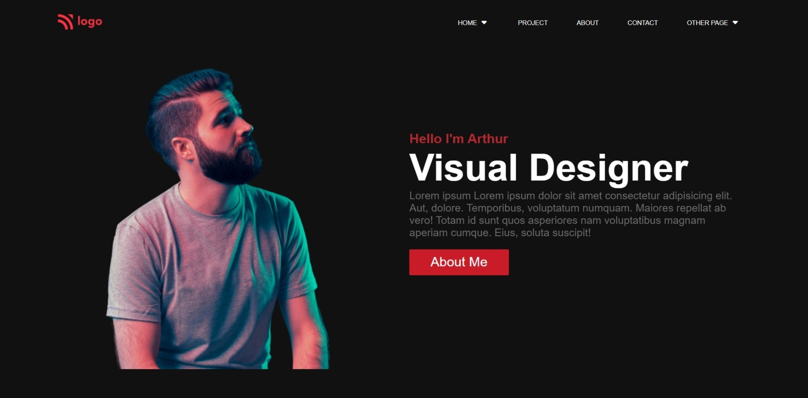
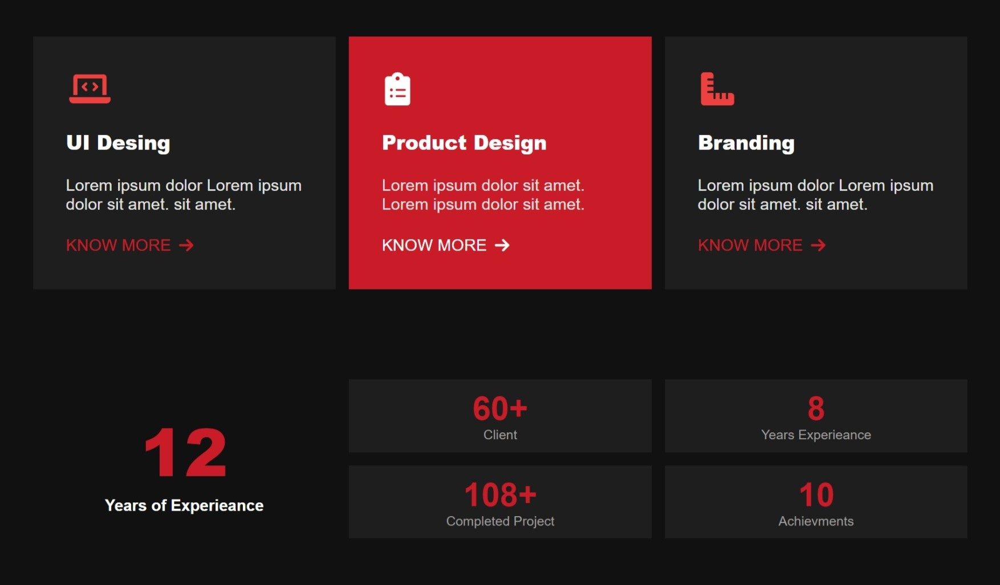
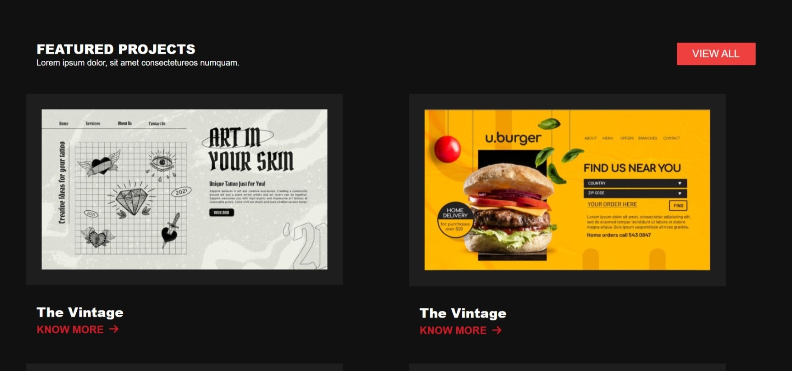

<!-- # FSD Javascript  Bootcamp -->
# Product Design Landing Page (HTML CSS Project - 15)

 

##  [Deployed Link  ](https://rahul-project-15.netlify.app/) 
Github Link : https://github.com/rsyeul/HTML-CSS-Project-15

Developed By : **Rahul Yeul**

### Screenshots:

Desktop screen :

 

 

 

Mobile screen: 

.png)
